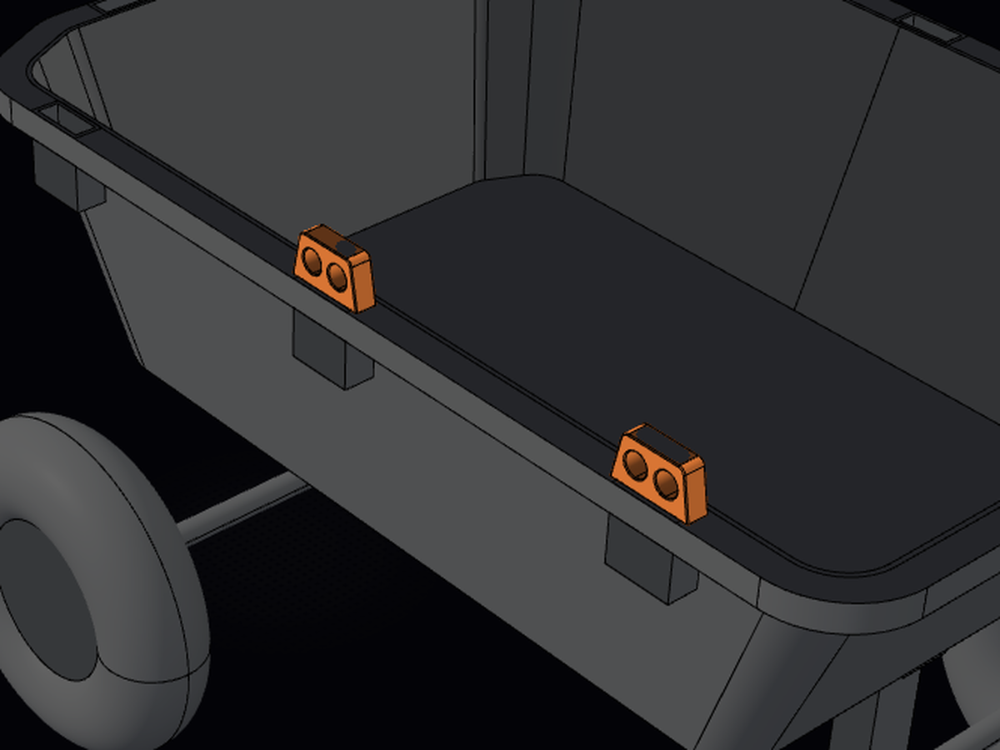
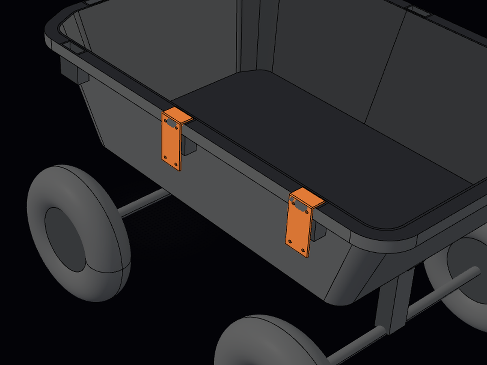

# Gorilla Cart Accessories

3D-printable accessories that plug into the rim cutouts of the [Gorilla Cart 200L Poly Dump Cart](https://gorillacarts.com.au/collections/poly-carts/products/gcg7-au). Nothing is drilled or bolted to the cart: each part drops into a cutout and lifts out again.

**[Open the STL generator](https://macropin.github.io/brepjs-gorillacart/)** to change an accessory's dimensions, preview it in 3D and download STL or STEP files, all in your browser.

## Accessories

<table>
<tr>
<td width="50%" valign="top">

[](docs/side-extension-kit.md)

### [Side extension kit](docs/side-extension-kit.md)

Raises the walls 150 mm on three sides, taking the cart from 200 L to about 280 L.

**Print:** 8 posts, 5 side panels, 2 corner panels

</td>
<td width="50%" valign="top">

[](docs/tie-down-block.md)

### [Tie-down block](docs/tie-down-block.md)

A strap point for holding down an oversize load such as branches.

**Print:** one per cutout, as many as you need

</td>
</tr>
<tr>
<td width="50%" valign="top">

[](docs/pole-holder.md)

### [Pole tool holder](docs/pole-holder.md)

A snap clip that carries a 25 mm tool pole along the rim. Its hooks hang on spring bands for a deep snap in PETG, or there's a compact rigid clip with rolled lips.

**Print:** two per pole

</td>
<td width="50%" valign="top">

[](docs/machete-sleeve.md)

### [Machete sleeve](docs/machete-sleeve.md)

A slotted bar that carries a machete on the rim.

**Print:** one

</td>
</tr>
<tr>
<td width="50%" valign="top">

[](docs/ego-battery-holder.md)

### [EGO battery holder](docs/ego-battery-holder.md)

Upright rails that an EGO 56V battery slides onto, as on a wall mount.

**Print:** one per battery

</td>
<td width="50%" valign="top">

[](docs/mounting-plate.md)

### [Mounting plate](docs/mounting-plate.md)

A flat plate that hangs outside the rim, to bolt a sheet of ply or anything else to. Leave the plate off for a bracket on the rim, with holes in its top.

**Print:** one per cutout, two or more to carry a sheet

</td>
</tr>
</table>

## Will it fit?

The accessories are designed for the 200L poly dump cart linked above. Its rim has eight cutouts, each 51.3 × 19.5 mm and 63.5 mm deep: three along each long side and two at the handle end. Every accessory stands on the same 51.0 × 19.2 mm key that drops into one.

The side extension kit uses all eight cutouts. The other accessories take one cutout each, in any combination. With the kit fitted, the machete sleeve, EGO battery holder and tie-down block bolt to its posts instead, two deep if you like, with M5 bolts: see [Stacking accessories](docs/side-extension-kit.md#stacking-accessories). The pole tool holder and the mounting plate don't stack on the posts, though the mounting plate can carry a registration boss of its own, for an accessory to bolt to it instead.

The mounting plate hangs outside the rim, 5 mm clear of its outside edge. That edge's position comes from Gorilla's product photos rather than a measurement, so check the plate clears your rim: see [Mounting plate](docs/mounting-plate.md#fitting).

Full measurements: [Cart cutout dimensions](docs/cart.md).

## Printing

| Part | Quantity | Overall size (mm) | Notes |
| --- | --- | --- | --- |
| [Side extension post](docs/side-extension-kit.md#posts) | 8 | 34.88 × 51.0 × 213.7 | Print standing |
| [Side panel](docs/side-extension-kit.md#side-panels) | 5 | 295.4 × 151.5 × 7.7 | **Needs a bed at least 296 mm long.** Print flat, lips up. Print the handle-end panel in PETG |
| [Corner panel](docs/side-extension-kit.md#corner-panels) | 1 left, 1 right | 142.3 × 164.6 × 150.7 | Print upside down on the top edge, with a brim |
| [Tie-down block](docs/tie-down-block.md) | 1 per cutout | 19.2 × 72 × 103.5 | Print lying on a broad face, no supports |
| [Pole tool holder](docs/pole-holder.md) | 2 per pole | 57.6 × 51.0 × 160.5 | Print in PETG, lying on one end face, no supports |
| [Pole tool holder, rigid clip](docs/pole-holder.md#rigid-clip) | 2 per pole, in place of the compliant ones | 32.1 × 51.0 × 135.9 | Print standing |
| [Machete sleeve](docs/machete-sleeve.md) | 1 | 19.2 × 51.0 × 193.5 | Print standing, with a brim |
| [EGO battery holder](docs/ego-battery-holder.md) | 1 per battery | 19.2 × 92 × 186.5 | Print standing, with a brim |
| [Mounting plate](docs/mounting-plate.md) | 1 per cutout, 2 or more per sheet | 32.6 × 51.0 × 104 | Print lying on one end, no supports |
| [Stack locator](docs/side-extension-kit.md#stack-locator) | 1 per accessory stacked on another | 52 × 18 × 6 | Print flat, no supports |

Each accessory's page has its printing and fitting instructions.

## Getting the files

The quickest way is the [STL generator](https://macropin.github.io/brepjs-gorillacart/): pick an accessory, change any of its dimensions, and download the files. It builds each part in your browser from the same source as below.

The models are code, so the STL and STEP files can also be built from source. This needs Node 24+ (`brew install node`).

```bash
make install
```

```bash
make export
```

The files land in `out/<part>/`. To change a dimension, edit the `defaults` block at the top of the part's `src/<part>.brep.ts` and export again.

See [Development](docs/development.md) for the toolchain, the other make targets and how the renders are produced.

## Licence

[MIT](LICENSE)
